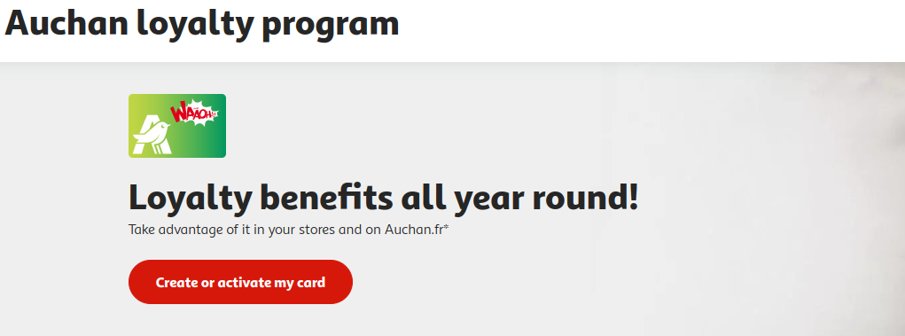

In France, you can buy groceries from a variety of stores, each offering different options and shopping experiences. Don't do your Grocery shopping in small shops. It can be expensive. So here's few stores that are good. Try to go to a big supermarket like :

:::info
Yo can download the mobile apps for below stores\* and reffer the catalogue to be informed about current offers and promos.
:::

<!-- truncate -->

1.  <u>[**Auchan**](https://www.auchan.fr/)</u>
    <figure>
    
    <figcaption>
    

    Source : Auchan logo from wikipedia
    

    </figcaption>
    </figure>

    Auchan hypermarkets are known for their large size and comprehensive product offerings. Customers can find fresh produce, groceries, clothing, electronics, home goods, and various other items all under one roof.

    Auchan, like many other retail chains, regularly offers discounts and promotions on various products. This includes seasonal sales, special offers, and loyalty programs for regular customers. You can get a loyalty card and keep track of all the points alloted.

    

2.  <u>[**Lidl**](https://www.lidl.fr/)</u>
    <figure>
    
    <figcaption>
    Source : Lidl logo from wikipedia
    </figcaption>
    </figure>

    Lidl is known for its discount supermarket model, offering a limited selection of products at competitive prices. The store format is designed to be efficient and cost-effective, with a focus on affordability for customers.

    Lidl regularly offers special promotions and discounts on various products. The store often features weekly or bi-weekly sales, attracting customers with limited-time offers on selected items.

    :::tip
    In my experience, Lidl offers some groceries items cheaper in comparison to other mention stores.
    :::

3.  <u>[**Carrefour**](https://www.carrefour.fr/)</u>
    <figure>
    
    <figcaption>
    Source : Carrefour logo from wikipedia
    </figcaption>
    </figure>

    Carrefour hypermarkets are known for their size and comprehensive product offerings. These stores typically include sections for fresh produce, groceries, clothing, electronics, home goods, and more.

    Carrefour regularly offers discounts and promotions on various products. These can include seasonal sales, special offers, and loyalty programs for regular customers.

4.  <u>[**Action**](https://www.action.com/fr-fr/)</u>
    <figure>
    
    <figcaption>
    Source : Action logo from wikipedia
    </figcaption>
    </figure>

    Action offers a diverse range of products, including household cleaning supplies, kitchenware, office supplies, home decor, electronics, clothing, toys, and seasonal items. The product assortment is regularly updated with new items.

5.  <u>[**Tang Frères**](https://www.tang-freres.fr/)</u>
    <figure>
    
    <figcaption>
    Source : Tang Frères logo from wikipedia
    </figcaption>
    </figure>

    Tang Frères specializes in providing a diverse range of Asian products, including fresh produce, spices, sauces, noodles, canned goods, frozen foods, and a variety of specialty items used in Asian cooking. The stores cater to the diverse Asian communities in France and attract customers interested in Asian cuisines.
