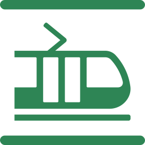
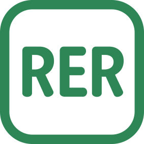

# Transportation in Paris

Transportation in Paris, France, is well-developed and offers a variety of options for students.

### Key aspects of transportation in Paris:

<table>
    <thead>
        <tr>
        <td>Medium</td>
        <td>Icon</td>
        <td>Description</td>
        </tr>
    </thead>
    <tbody>
    <tr>
        <td>Metro</td>
        <td> </td>
        <td> 
            Paris has an extensive and efficient metro system, with multiple lines covering the city and suburbs. It's a popular choice for getting around quickly and avoiding traffic.
        </td>
    </tr>
    <tr>
        <td>Bus</td>
        <td>  </td>
        <td> 
           The city has an extensive bus network that complements the metro system, providing coverage to areas not served by the subway.
        </td>
    </tr>
    <tr>
        <td>Tram</td>
        <td> </td>
        <td> 
          Tram lines connect various parts of the city and suburbs, offering another option for public transportation.
        </td>
    </tr>
    <tr>
        <td>RER </td>
        <td> </td>
        <td> 
          The RER (Réseau Express Régional) is a regional express train network that connects Paris with its suburbs. It is particularly useful for traveling to areas outside the city center.
        </td>
    </tr>
    <tr>
        <td>Bicycles</td>
        <td> </td>
        <td> 
           Paris has implemented a successful bike-sharing program called "Vélib'," which allows users to rent bicycles at various locations throughout the city. Cycling is a popular and eco-friendly way to explore Paris.
        </td>
    </tr>
    </tbody>
</table>

## Simple Ticket

Simple tickets are valid only for one way type of transportation (Bus, RER, Metro, Tramp). Price for a single one-way trip on all RER networks in Paris metro, trampway and bus is as below :

:::info
Fares of 2024
:::

<table>
    <thead>
        <tr>
        <td>Quantity</td>
        <td>Ticket t+ paper ticket</td>
        <td>Ticket t+ on Navigo Easy or smartphone</td>
        </tr>
    </thead>
    <tbody>
    <tr>
        <td>Single ticket</td>
        <td> €2.15</td>
        <td> €2.15</td>
    </tr>
    <tr>
        <td>Book of 10 tickets</td>
        <td>no longer on sale</td>
        <td>€19.60</td>
    </tr>
    <tr>
        <td>Book of 10 tickets (reduced price)</td>
        <td>no longer on sale</td>
        <td>€9.80</td>
    </tr>
    </tbody>
</table>
		
For more information : [Ticket t+](https://www.iledefrance-mobilites.fr/en/tickets-fares/detail/ticket-t)

## Navigo Card

The Navigo card is a convenient and cost-effective way to use public transportation in Paris. It provides unlimited access to buses, trams, and the metro within specific zones.

**Students under the age of 26** are able to enroll for the [Imagine R transportation](https://www.iledefrance-mobilites.fr/en/tickets-fares/detail/imagine-r-student-ticket) card online after getting your bank account open. The imagine R pass is valid for unlimited trips in the lle-de-France region.

:::tip
The price for imagine R pass is €374.40/year plus €8 administration fees as of 1 January 2024.
:::

It also grants full, unrestricted access to all public transport in the lle-de-France region during the weekend and
summer holidays (available for 1 year).

**Students 26 years old +** have to pay €86.40 per month for all zones(1-5).

:::info
Fares applicable as of 1 January 2024 for Navigo Monthly Ticket
:::

<table>
    <thead>
        <tr>
        <td>Zones</td>
        <td>Fare</td>
        </tr>
    </thead>
    <tbody>
    <tr>
        <td>All zones 1 to 5</td>
        <td> €86.40</td>
    </tr>
    <tr>
        <td>2 to 3</td>
        <td>€78.80</td>
    </tr>
    <tr>
        <td>3 to 4</td>
        <td>€76.80</td>
    </tr>
    <tr>
        <td>4 to 5</td>
        <td>€74.80</td>
    </tr>
    </tbody>
</table>

For more information : [Navigo Monthly Ticket](https://www.iledefrance-mobilites.fr/en/tickets-fares/detail/navigo-monthly-ticket)
